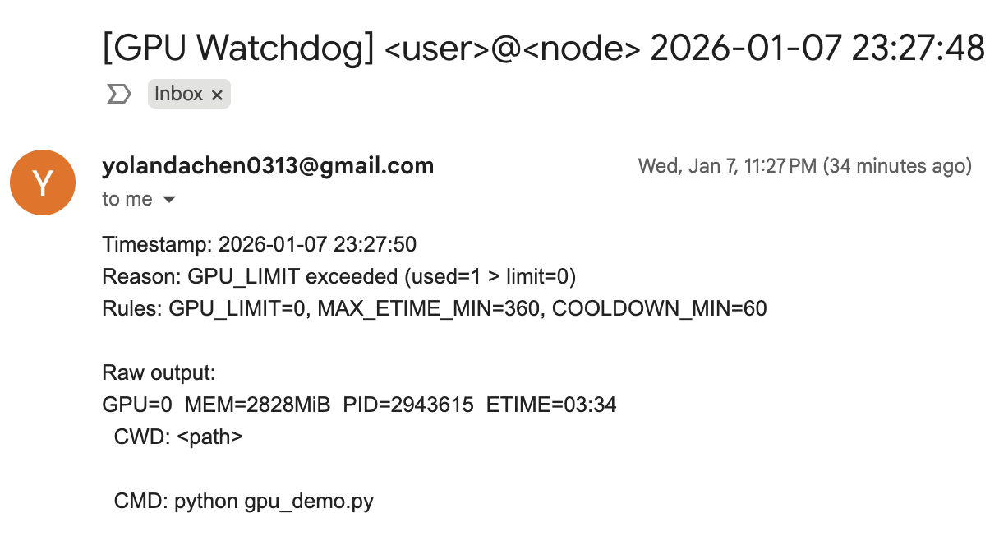
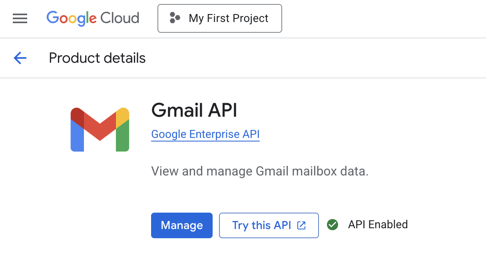
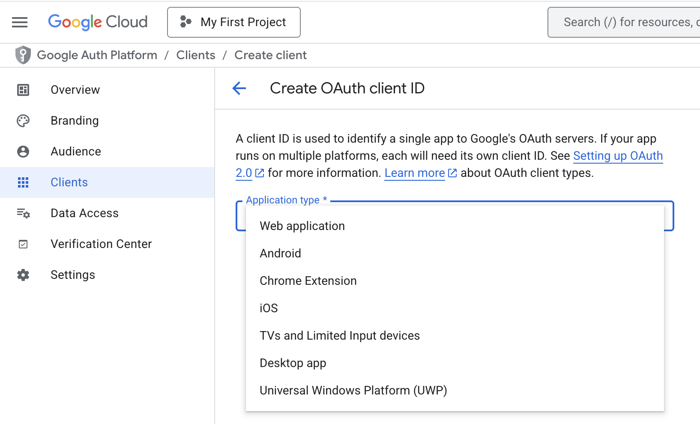
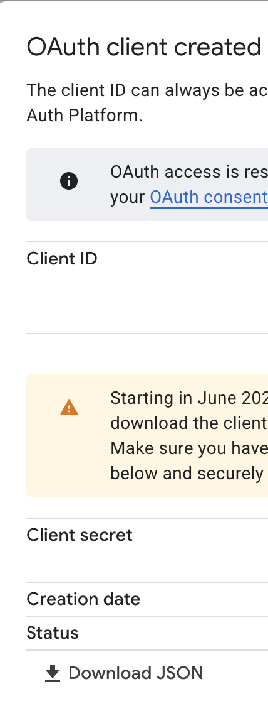
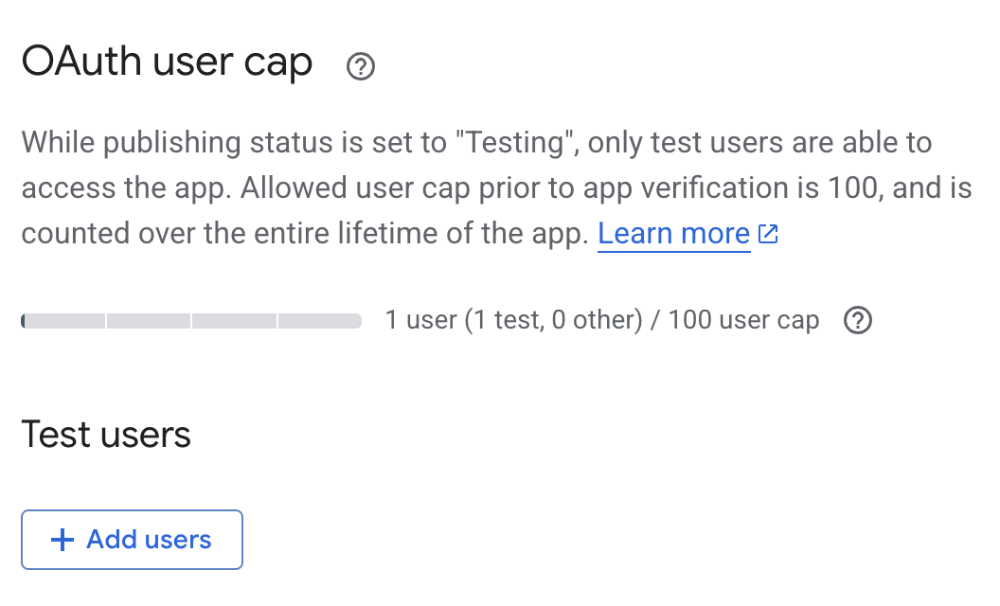

# GPU Watchdog 🐩

<p align="center">
  <a href="#-motivation">Motivation</a> •
  <a href="#-overview">Overview</a> •
  <a href="#-preview">Preview</a> •
  <a href="#-usage">Usage</a> •
  <a href="#-quickstart">Quickstart</a> •
  <a href="#-customization">Customization</a> •
  <a href="#-gmail-api-setup">Gmail API Setup</a> •
  <a href="#-faq">FAQ</a> •
  <a href="#-directory-structure">Directory Structure</a> •
  <a href="#-acknowledgements">Acknowledgements</a> •
  <a href="#-contact">Contact</a> •
  <a href="#-organizers">Organizers</a>
</p>

---

## 📌 Motivation

In shared GPU or multi-user HPC environments, you often run into situations like:

- You are training, but the GPUs are fully occupied by others, and your job slows down sharply or even OOMs;
- You want to quickly know who is using the GPUs on the current machine;
- You want to automatically remind yourself when GPUs enter certain states (so you do not have to keep staring at `nvidia-smi`).

The goal of GPU Watchdog 🐩 is: with minimal dependencies, a Bash script that can run directly on clusters, periodically reads GPU process information, and notifies you by email when trigger rules fire.

## 🚀 Overview

GPU Watchdog is a lightweight GPU monitoring and notification tool:

- Wraps `nvidia-smi` output via `bin/mygpu.sh` (lists per-process fields like `GPU=... PID=... ETIME=...`)
- `bin/gpu_watch.sh` decides whether to alert based on rules, with de-duplication and cooldown to prevent spamming
- Supports two notification methods:
  - ✅ Gmail API (recommended): uses HTTPS 443, which clusters are usually more likely to allow
  - ✅ SMTP (alternative): use when your cluster allows outbound SMTP
- In `auto` mode it may try local mail/mailx/sendmail, but whether it works depends on the cluster mail system; in cluster environments, Gmail API is recommended first.

## 👀 Preview

### 1) Terminal monitoring output


Contents include:

- A list of GPU processes in use, including GPU id, pid, etime, program path, run command, and more

### 2) Email alert example



Contents include:

- Timestamp
- Trigger reason and predefined rules
- Raw output (helpful for tracing and debugging)

Note: The above screenshots are for demonstration; paths are redacted. In actual runs, real paths will be printed.

## 🧭 Usage

Default monitoring logic (see `bin/gpu_watch.sh`):

- Count the number of GPUs currently in use (deduplicated by GPU id appearing in per-process output)
- Find the single GPU process with the longest runtime (ETIME)
- Alert when any of the following conditions is met:
  - `GPU_COUNT > GPU_LIMIT`
  - The `MAX_ETIME_MIN` minute threshold is exceeded (i.e., a process has been running for too long)

It also includes anti-spam mechanisms:

- The same alert will not be sent again within `COOLDOWN_MIN`

## ⚡ Quickstart

### 1) Get the code

```bash
git clone https://github.com/Yukyin/gpu-watchdog.git
cd gpu-watchdog
```

### 2) Prepare config files

```bash
cp config/gpu-watch.env.example  config/gpu-watch.env
cp config/notify.env.example     config/notify.env   # Gmail (recommended)
cp config/smtp.env.example       config/smtp.env     # SMTP (optional)
```

### 3) Run a Dry Run once (no email is sent; only prints subject and body)

```bash
bash bin/gpu_watch.sh --dry-run
```

Note: If no trigger condition is currently met, `--dry-run` may produce no output; this is normal. To see real-time usage, run `bash bin/mygpu.sh`.

### 4) Test mail (force send; skip de-dup and cooldown)

```bash
bash bin/gpu_watch.sh --test-mail
```

## 🕰️ Long-running modes

Three commonly used approaches:

### Mode A: Temporary viewing

Refresh current GPU processes every 60 seconds:

```bash
watch -n 60 bash bin/mygpu.sh
```

### Mode B: Resident loop (recommended)

Check once every 5 minutes; send an email when rules fire:

```bash
while true; do
  bash bin/gpu_watch.sh
  sleep 300
done
```

You can also keep it running long-term in `tmux` / `screen`.

### Mode C: crontab (production-friendly)

Run once every 5 minutes:

```bash
crontab -e
```

Add a line (replace `<repo-dir>` with your actual path):

```bash
*/5 * * * * cd <repo-dir> && bash bin/gpu_watch.sh >/dev/null 2>&1
```

> Tip: If your cluster nodes reboot or interactive sessions get reclaimed, crontab is often more stable than while true loops.

## 🛠️ Customization

This project’s configuration entry points are mainly three files:

- `config/gpu-watch.env`: trigger rules, and recipient
- `config/notify.env`: notification method selection, Gmail API configuration
- `config/smtp.env`: SMTP configuration (optional; required when using SMTP)

Environment-variable overrides are also supported, which is useful for reusing one codebase across multiple machines or multiple configuration sets.

### A. `config/gpu-watch.env`

> This section determines: when to alert, and who to send to.

#### `TO_EMAIL`

- **Meaning**: recipient email address for alert emails.
- **Example**: `TO_EMAIL="you@example.com"`
- **Note**: if empty, the script will error out and exit.

#### `GPU_LIMIT`

- **Meaning**: alert when the number of “GPUs currently in use” is greater than this value.
- **Example**: `GPU_LIMIT=2`
- **Explanation**: the script extracts `GPU=...` from `mygpu.sh` output and deduplicates it to compute `GPU_COUNT`.

#### `MAX_ETIME_MIN`

- **Meaning**: alert when the runtime (ETIME) of any GPU process exceeds this number of minutes.
- **Example**: `MAX_ETIME_MIN=360`
- **Explanation**: the script selects the maximum ETIME across all processes as `MAX_ETIME` and compares it to the threshold.

#### `COOLDOWN_MIN`

- **Meaning**: cooldown time (minutes) for the same alert signature; no repeated sends within the cooldown window.
- **Example**: `COOLDOWN_MIN=60`
- **Signature mechanism**: SHA256 computed from trigger reasons and raw output, used for de-duplication.


### B. `config/notify.env`

> This section determines: how to send email.  
> Note: the recipient `TO_EMAIL` is not here; it is in `gpu-watch.env`.

#### `NOTIFY_METHOD`

- **Meaning**: notification backend selection.
- **Values**: `gmail_api | smtp | auto`
  - `gmail_api`: force Gmail API (recommended)
  - `smtp`: force SMTP (requires `config/smtp.env` to exist and be usable)
  - `auto`: automatic mode (the script tries available methods according to its own logic)
- **Example**: `NOTIFY_METHOD="gmail_api"`

#### `GMAIL_API_CREDENTIALS`

- **Meaning**: absolute path to the OAuth client `credentials.json`.
- **Example**: `GMAIL_API_CREDENTIALS="/ABS/PATH/to/credentials.json"`

#### `GMAIL_API_TOKEN`

- **Meaning**: absolute path to the generated `token.json` after authorization.
- **Example**: `GMAIL_API_TOKEN="/ABS/PATH/to/token.json"`

#### `FROM_EMAIL`

- **Meaning**: sender email address.
- **Example**: `FROM_EMAIL="you@example.com"`
- **Suggestion**: match the Gmail account associated with the token.


### C. `config/smtp.env`

> Required only when `NOTIFY_METHOD="smtp"` or when the script takes the SMTP path.

#### `SMTP_HOST`

- SMTP server host, e.g. `smtp.example.com`

#### `SMTP_PORT`

- Commonly `587` (STARTTLS) or `465` (SSL)

#### `SMTP_USER` / `SMTP_PASS`

- SMTP username and password (use an app-specific password if possible)

#### `FROM_EMAIL`

- If not set, the script will default to `SMTP_USER`


### D. Optional: override config file paths with environment variables

Convenient for multiple configurations with the same codebase:

- `GPUWATCH_CONFIG=/path/to/gpu-watch.env`
- `GPUWATCH_NOTIFY_CONFIG=/path/to/notify.env`
- `GPUWATCH_SMTP_CONFIG=/path/to/smtp.env`
- `GPUWATCH_CACHE=/path/to/cache`
- `MYGPU=/path/to/mygpu.sh`

Example:

```bash
GPUWATCH_CONFIG=/tmp/gpu-watch.env GPUWATCH_NOTIFY_CONFIG=/tmp/notify.env bash bin/gpu_watch.sh --dry-run
```

## 🔐 Gmail API Setup

> Goal: obtain two files  
> `secret/credentials.json` and `secret/token.json`

The repository’s `secret/README.md` also provides more detailed instructions.

### 1) Enable the Gmail API

In the Google Cloud Console (under the same project):

- APIs & Services → Library → Gmail API → Enable



### 2) Create an OAuth Client ID

- APIs & Services → Credentials → Create Credentials → OAuth client ID
- Application type: Desktop app
- Download the JSON and save it as: `secret/credentials.json`. Do not click “Done” yet; make sure you download on this page.





### 3) Add a test user in Google Auth Platform

- Click “Audience” and “Add users”
- Enter your Gmail address



### 4) Generate `secret/token.json`

Install dependencies:

```bash
python -m pip install google-api-python-client google-auth google-auth-oauthlib google-auth-httplib2

```

Run the following script on the cluster to generate the token (it will print a URL):

```bash
BASE="$(pwd)"
BASE="$BASE" python - <<'PY'
import os
from google_auth_oauthlib.flow import InstalledAppFlow

BASE = os.environ["BASE"]
creds = f"{BASE}/secret/credentials.json"
token = f"{BASE}/secret/token.json"
scopes = ["https://www.googleapis.com/auth/gmail.send"]

flow = InstalledAppFlow.from_client_secrets_file(creds, scopes=scopes)
creds_obj = flow.run_local_server(
    host="127.0.0.1",
    port=8765,
    open_browser=False,
    authorization_prompt_message="Open this URL in your browser:\n{url}\n",
    success_message="✅ Auth OK. You can close this tab.",
)

with open(token, "w") as f:
    f.write(creds_obj.to_json())
print("Wrote token:", token)
PY
```

If you need to open the authorization page in a local browser, a common approach is SSH port forwarding:

```bash
ssh -L 8765:127.0.0.1:8765 <user>@<cluster-host>
```

## 🧩 FAQ

#### Q1: SMTP is blocked on the cluster, what should I do?

Prefer Gmail API (HTTPS 443), which is usually easier to pass through firewalls.

#### Q2: I only want to be reminded when too many GPUs are occupied

Set `MAX_ETIME_MIN` very large, and rely mainly on `GPU_LIMIT`.

#### Q3: I only want to be reminded when a process runs for too long

Set `GPU_LIMIT` very large, and rely mainly on `MAX_ETIME_MIN`.

#### Q4: Alerts are too frequent, what should I do?

Increase `COOLDOWN_MIN`. The same alert signature will not be resent during the cooldown window.

## 🗂️ Directory Structure

```
.
├── bin/
│   ├── gpu_watch.sh
│   ├── mygpu.sh
│   ├── send_gmail_api.py
│   └── send_smtp.py
├── config/
│   ├── gpu-watch.env.example
│   ├── notify.env.example
│   └── smtp.env.example
├── cache/                 # runtime de-dup/cooldown records (last_sent/last_sig)
├── secret/                # OAuth-related files (do not share casually)
│   └── README.md
├── LICENSE
├── README.md
└── README.zh-CN.md
```

## 🙏 Acknowledgements

- NVIDIA `nvidia-smi`
- Gmail API / OAuth2 authorization flow


## ❤️ Contact

- If you have any questions or suggestions, please feel free to open a GitHub issue.
- You can also reach out [Yuyan Chen](mailto:yolandachen0313@gmail.com).


## 👥 Organizers

Thanks to the following contributors for organizing this project.

<p align="left">
  <a href="https://github.com/Yukyin">
    
  </a>
</p>
