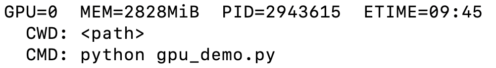
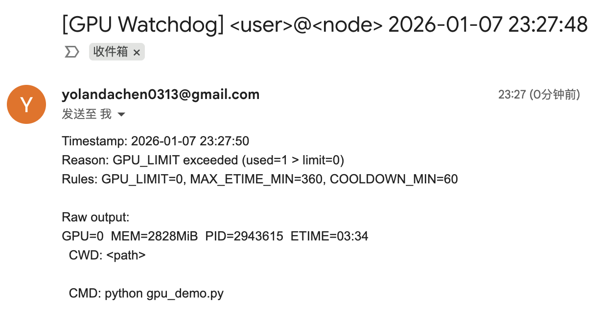
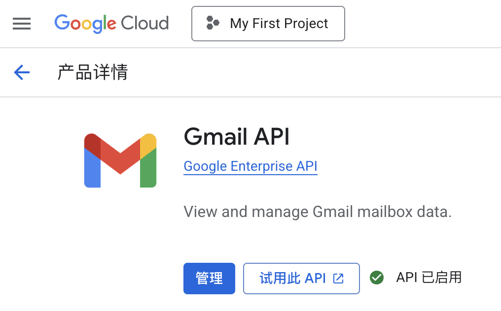
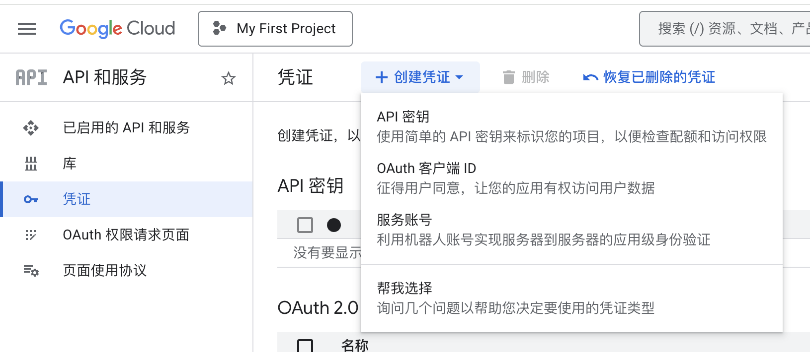
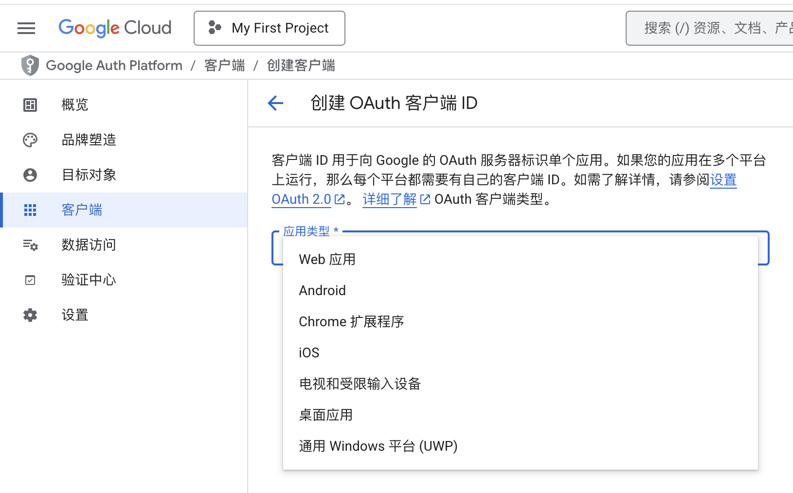
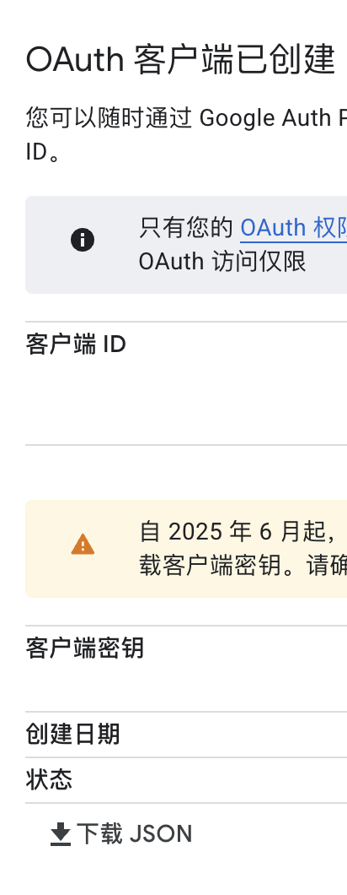
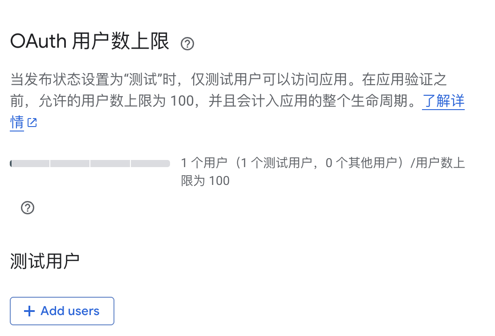

# GPU Watchdog 🐩

<p align="center">
  <a href="#-项目动机">项目动机</a> •
  <a href="#-项目简介">项目简介</a> •
  <a href="#-项目预览">项目预览</a> •
  <a href="#-使用说明">使用说明</a> •
  <a href="#-快速上手指南">快速上手指南</a> •
  <a href="#-定制化指南">定制化指南</a> •
  <a href="#-gmail-api-配置推荐">Gmail API 配置</a> •
  <a href="#-常见问题">常见问题</a> •
  <a href="#-目录结构">目录结构</a> •
  <a href="#-致谢">致谢</a> •
  <a href="#-联系">联系</a> •
  <a href="#-组织者">组织者</a>
</p>

---

## 📌 项目动机

在共享 GPU 或者多用户 HPC 环境里，经常会遇到这些情况：

- 你在跑训练，但 GPU 被他人占满，任务速度骤降甚至 OOM；
- 你想快速知道当前这台机器上到底谁在用 GPU；
- 你希望在 GPU 出现特定状态时自动提醒自己（不用一直盯着 `nvidia-smi`）。

GPU Watchdog 🐩的目标是：用最少依赖、可在集群上直接跑的 Bash 脚本，周期性读取 GPU 进程信息，并在触发规则时通过邮件通知你。

## 🚀 项目简介

GPU Watchdog 是一个轻量级 GPU 监控与通知小工具：

- 通过 `bin/mygpu.sh` 封装 `nvidia-smi` 输出（按进程列出 `GPU=... PID=... ETIME=...` 等字段）
- `bin/gpu_watch.sh` 根据规则判断是否告警，并带有去重和冷却，防止刷屏
- 支持两种邮件通知方式：
  - ✅ Gmail API（推荐）：走 HTTPS 443，通常集群更容易放行
  - ✅ SMTP（备选）：当你的集群允许出站 SMTP 时使用
- auto 模式下可能尝试本机 mail/mailx/sendmail，但是否可用取决于集群邮件系统；集群环境优先推荐 Gmail API。

## 👀 项目预览

### 1) 终端监控输出



内容包含：

- GPU 使用进程列表，含 GPU id、pid、etime 、程序路径、运行命令等

### 2) 邮件告警示例



内容包含：

- 时间戳
- 触发原因和预定义规则
- 原始输出（方便回溯定位）

注意：以上截图为展示原因，对路径做了脱敏处理。实际运行时候会打印真实路径。

## 🧭 使用说明

默认监控逻辑（见 `bin/gpu_watch.sh`）：

- 统计当前被使用中的 GPU 数量（按进程输出里出现的 GPU id 去重计数）
- 找到所有GPU 进程里运行时（ETIME）最长的那一条
- 只要满足以下任一条件就告警：
  - `GPU_COUNT > GPU_LIMIT`
  - `MAX_ETIME_MIN` 分钟阈值被超过（即某个进程运行时间过长）

并且带有防刷屏机制：

- 同一条告警在 `COOLDOWN_MIN` 内不会重复发送

## ⚡ 快速上手指南

### 1) 获取代码

```bash
git clone https://github.com/MLNLP-World/gpu-watchdog.git
cd gpu-watchdog
```

### 2) 准备配置文件

```bash
cp config/gpu-watch.env.example  config/gpu-watch.env
cp config/notify.env.example     config/notify.env   # Gmail推荐）
cp config/smtp.env.example       config/smtp.env     # SMTP（可选）
```

### 3) 运行一次 Dry Run（不发邮件，仅打印主题和正文）

```bash
bash bin/gpu_watch.sh --dry-run
```

注意：如果当前没有触发条件，`--dry-run` 可能不输出，属于正常现象。要看实时占用请用 `bash bin/mygpu.sh`。

### 4) 测试发信（强制发送，跳过去重和冷却）

```bash
bash bin/gpu_watch.sh --test-mail
```

## 🕰️ 长期运行方式

下面给三种常用方式：

### 方式 A：临时查看

每 60 秒刷新一次当前 GPU 进程：

```bash
watch -n 60 bash bin/mygpu.sh
```

### 方式 B：常驻循环（推荐）

每 5 分钟检查一次，触发规则就发邮件：

```bash
while true; do
  bash bin/gpu_watch.sh
  sleep 300
done
```

你也可以把它放进 `tmux` / `screen` 里长期挂着。

### 方式 C：crontab（生产友好）

每 5 分钟跑一次：

```bash
crontab -e
```

加入一行（把 `<repo-dir>` 换成你的实际路径）：

```bash
*/5 * * * * cd <repo-dir> && bash bin/gpu_watch.sh >/dev/null 2>&1
```

> 提示：如果你的集群节点会重启或会回收交互会话，crontab 往往比 while true 更稳。

## 🛠️ 定制化指南

本项目的配置入口主要是三份文件：

- `config/gpu-watch.env`：触发规则，填写收件人
- `config/notify.env`：通知方式选择，Gmail API 配置
- `config/smtp.env`：SMTP 配置（可选，用 SMTP 时需要）

此外也支持环境变量覆盖，适合多台机器或者多套配置复用。

### A. `config/gpu-watch.env`

> 这一部分决定：什么时候告警，发给谁。

#### `TO_EMAIL`

- **含义**：告警邮件的收件人地址。
- **示例**：`TO_EMAIL="you@example.com"`
- **注意**：如果为空，脚本会直接报错退出。

#### `GPU_LIMIT`

- **含义**：当检测到“正在使用中的 GPU 数量”大于该值时告警。
- **示例**：`GPU_LIMIT=2`
- **解释**：脚本会从 `mygpu.sh` 的输出中提取 `GPU=...`，去重后计数为 `GPU_COUNT`。

#### `MAX_ETIME_MIN`

- **含义**：当任一 GPU 进程的运行时间（ETIME）超过该分钟数时告警。
- **示例**：`MAX_ETIME_MIN=360`
- **解释**：脚本会选取所有进程里 ETIME 最大的一条作为 `MAX_ETIME`，并与阈值比较。

#### `COOLDOWN_MIN`

- **含义**：同一条告警签名的冷却时间（分钟），冷却期内不重复发送。
- **示例**：`COOLDOWN_MIN=60`
- **签名机制**：由触发原因和raw 输出计算 SHA256，用于去重。


### B. `config/notify.env`

> 这一部分决定：用什么方式发邮件。  
> 注意：收件人 `TO_EMAIL` 不在这里，在 `gpu-watch.env` 里。

#### `NOTIFY_METHOD`

- **含义**：通知后端选择。
- **可选值**：`gmail_api | smtp | auto`
  - `gmail_api`：强制使用 Gmail API（推荐）
  - `smtp`：强制使用 SMTP（要求 `config/smtp.env` 存在且可用）
  - `auto`：自动模式（脚本会按自身逻辑尝试可用的方式）
- **示例**：`NOTIFY_METHOD="gmail_api"`

#### `GMAIL_API_CREDENTIALS`

- **含义**：OAuth client 的 `credentials.json` 绝对路径。
- **示例**：`GMAIL_API_CREDENTIALS="/ABS/PATH/to/credentials.json"`

#### `GMAIL_API_TOKEN`

- **含义**：授权后生成的 `token.json` 绝对路径。
- **示例**：`GMAIL_API_TOKEN="/ABS/PATH/to/token.json"`

#### `FROM_EMAIL`

- **含义**：发件人邮箱。
- **示例**：`FROM_EMAIL="you@example.com"`
- **建议**：与 token 对应的 Gmail 一致。


### C. `config/smtp.env`

> 仅当 `NOTIFY_METHOD="smtp"` 或脚本走 SMTP 路径时需要。

#### `SMTP_HOST`

- SMTP 服务器地址，例如 `smtp.example.com`

#### `SMTP_PORT`

- 常见为 `587`（STARTTLS）或 `465`（SSL）

#### `SMTP_USER` / `SMTP_PASS`

- SMTP 账号与密码（建议使用应用专用密码）

#### `FROM_EMAIL`

- 若未设置，脚本会默认使用 `SMTP_USER`


### D. 可选：用环境变量覆盖配置文件路径

对同一份代码，多套配置很方便：

- `GPUWATCH_CONFIG=/path/to/gpu-watch.env`
- `GPUWATCH_NOTIFY_CONFIG=/path/to/notify.env`
- `GPUWATCH_SMTP_CONFIG=/path/to/smtp.env`
- `GPUWATCH_CACHE=/path/to/cache`
- `MYGPU=/path/to/mygpu.sh`

示例：

```bash
GPUWATCH_CONFIG=/tmp/gpu-watch.env \
GPUWATCH_NOTIFY_CONFIG=/tmp/notify.env \
bash bin/gpu_watch.sh --dry-run
```

## 🔐 Gmail API 配置

> 目标：得到两个文件  
> `secret/credentials.json` 和 `secret/token.json`

仓库里 `secret/README.md` 也提供了更详细的说明。

### 1) 开启 Gmail API

在 Google Cloud Console 中（同一个项目下）：

- API和服务 → 库 → Gmail API → 启用



### 2) 创建OAuth客户端ID

- API和服务 → 凭证 → 创建凭证 → OAuth客户端ID
- 应用类型: 桌面应用
- 下载 JSON，保存为：`secret/credentials.json`，先不要点击确定，务必在此页面下载





### 3) Google Auth Platform 加入测试用户

- 点击目标对象和Add users
- 输入你的 Gmail邮箱



### 4) 生成 `secret/token.json`

安装依赖：

```bash
python -m pip install google-api-python-client google-auth google-auth-oauthlib google-auth-httplib2
```

在集群上跑以下脚本生成 token（会打印一个 URL）：

```bash
BASE="$(pwd)"
BASE="$BASE" python - <<'PY'
import os
from google_auth_oauthlib.flow import InstalledAppFlow

BASE = os.environ["BASE"]
creds = f"{BASE}/secret/credentials.json"
token = f"{BASE}/secret/token.json"
scopes = ["https://www.googleapis.com/auth/gmail.send"]

flow = InstalledAppFlow.from_client_secrets_file(creds, scopes=scopes)
creds_obj = flow.run_local_server(
    host="127.0.0.1",
    port=8765,
    open_browser=False,
    authorization_prompt_message="Open this URL in your browser:\n{url}\n",
    success_message="✅ Auth OK. You can close this tab.",
)

with open(token, "w") as f:
    f.write(creds_obj.to_json())
print("Wrote token:", token)
PY
```

如果你需要从本地浏览器打开授权页面，常见做法是在本地进行 SSH 端口转发：

```bash
ssh -L 8765:127.0.0.1:8765 <user>@<cluster-host>
```

## 🧩 常见问题

#### Q1: 集群禁了SMTP，怎么办？

优先用Gmail API（HTTPS 443），通常更容易通过防火墙。

#### Q2: 我想只在GPU被占用过多时提醒

把 `MAX_ETIME_MIN` 设置得很大，主要依赖 `GPU_LIMIT`。

#### Q3: 我想只在某个进程跑太久时提醒

把 `GPU_LIMIT` 设得很大，主要依赖 `MAX_ETIME_MIN`。

#### Q4: 告警太频繁怎么办？

增大 `COOLDOWN_MIN`。同一告警签名在冷却时间内不会重复发送。

## 🗂️ 目录结构

```
.
├── bin/
│   ├── gpu_watch.sh
│   ├── mygpu.sh
│   ├── send_gmail_api.py
│   └── send_smtp.py
├── config/
│   ├── gpu-watch.env.example
│   ├── notify.env.example
│   └── smtp.env.example
├── cache/                 # 运行态去重/冷却记录（last_sent/last_sig）
├── secret/                # OAuth相关文件（不要随意发送）
│   └── README.md
├── LICENSE
├── README.md
└── README.zh-CN.md
```

## 🙏 致谢

- NVIDIA `nvidia-smi`
- Gmail API / OAuth2 授权流程


## ❤️ 联系

- 如果你有任何问题或建议，欢迎提交 GitHub Issue。
- 你也可以通过邮件联系[Yuyan Chen](mailto:yolandachen0313@gmail.com)。


## 👥 组织者

感谢以下同学对本项目的组织

<p align="left">
  <a href="https://github.com/Yukyin">
    
  </a>
</p>

